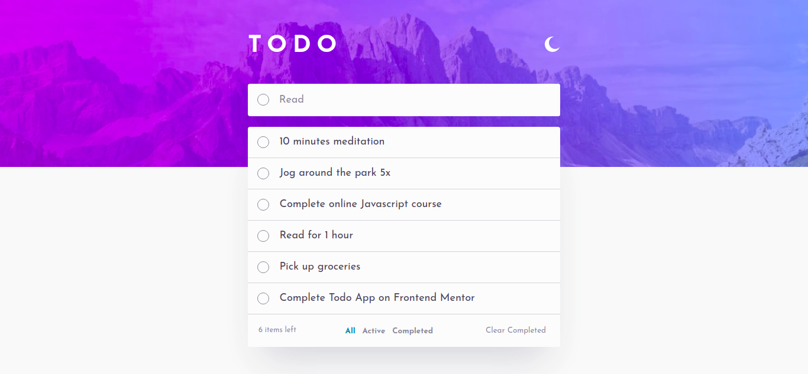
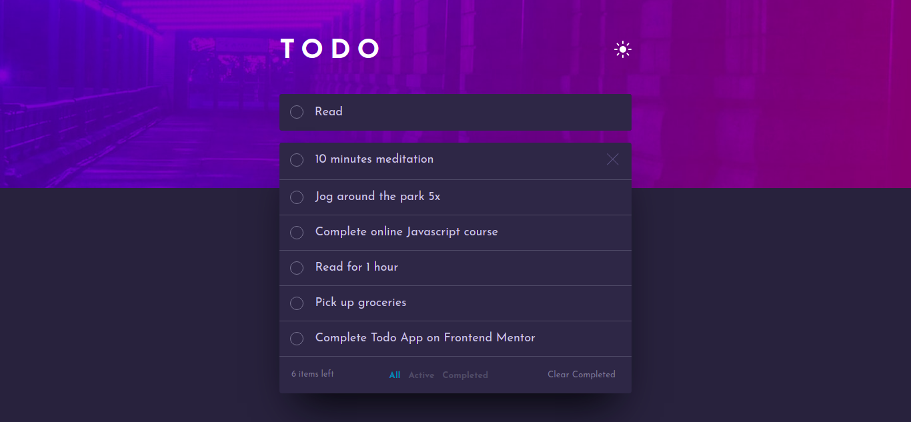
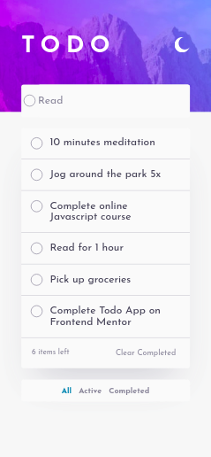
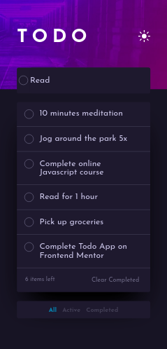

# A Fully Functional Todo Web Application

## Table of contents

- [Project setup](#project-setup)
  - [Compiles and Hot-reloads for Development](#compiles-and-hot-reloads-for-development)
  - [Compiles and minifies for production](#compiles-and-minifies-for-production)\
  - [Lints and fixes files](#lints-and-fixes-files)
- [Overview](#overview)
  - [Features](#features)
  - [Screenshots](#screenshots)
- [My process](#my-process)
  - [Built with](#built-with)
  - [What I learned](#what-i-learned)
  - [Continued development](#continued-development)
  - [Useful resources](#useful-resources)
- [Author](#author)

## Project setup

```
npm install

```

### Compiles and hot-reloads for development

```
npm run serve
```

### Compiles and minifies for production

```
npm run build
```

### Lints and fixes files

```
npm run lint
```

## Overview

### Features

Users are able to:

- View the optimal layout for the app depending on their device's screen size
- See hover states for all interactive elements on the page
- Add new todos to the list
- Mark todos as complete
- Delete todos from the list
- Filter by all/active/complete todos
- Clear all completed todos
- Toggle light and dark mode

### Screenshots






## My process

### Built with

- Semantic HTML5 markup
- CSS custom properties
- Flexbox
- CSS Grid
- Mobile-first workflow
- [VueJS](https://vuejs.org/) - JS library

### What I learned

- How best to seperate concerns in VueJS Single File Components
- All Vuex store logic should be placed in the store actions, the mutations should be kept as simple as possible and getters are just like computed properties (but for the store). For example:

```js
//A VUEX STORE MUTATION
ADD_NEW_TODO(state, newTodo) {
	state.todos.unshift(newTodo);
},
```

- The store actions can directly access its getters and state and this can be done by passing them as an argument to each store action via object destructuring.

```js
//A VUEX STORE ACTION
deleteTodo({ commit, getters, state }, currentTodo) {
	let todoIndex = getters.getTodoIndex(currentTodo);
        if (todoIndex >= 0) {
        	commit("DELETE_TODO", todoIndex);
	}
},
//A VUEX STORE GETTER
getTodoIndex: (state) => (currentTodo) =>
	state.todos.findIndex(
        	(todo) =>
          	 todo.title === currentTodo.title && todo.active === currentTodo.active
      	),
```

- The store mutations are unable to access getters and actions and exist for the sole purpose of mutating the store state
- How to implement a simple event bus to emit an event from a child component (via eventBus.$emit) and listen to that event from another child component (via eventBus.$on) in the created lifecycle hook of that component. This is a lot easier than re-emiting events up the chain and down to another child components

```js
export const eventBus = new Vue();
//IMPORTING INTO CHILD COMPONENT
import { eventBus } from "@/main.js";
//CHILD COMPONENT EMITTING AN EVENT
eventBus.$emit('change-theme')
//CHILD COMPONENT LISTENING TO THE EVENT IN ITS CREATED LIFECYCLE HOOK
created() {
    eventBus.$on("change-theme", this.setSelectedTheme);
},
```

- How to properly link external component styles to my SFC's scoped styles via the "src" attribute

```html
<style scoped src="@/assets/styles/Layout/TheTodoList.css"></style>
```

- How to properly implement a light and dark theme toggle via CSS color variables in the root element and toggling between that and the :root "[data-theme="Dark"]" inside of the chosen SFC

```CSS
:root {
  /*CSS VARIABLES WITH RESPECTIVE COLOR SCHEMES IN LIGHT THEME*/
}
[data-theme="Dark"] {
  /*CSS VARIABLES WITH RESPECTIVE COLOR SCHEMES IN DARK THEME*/
}
```

```js
//SETTING ROOT ELEMENT ATTRIBUTE TO CURRENT THEME
document.documentElement.setAttribute("data-theme", this.theme);
```

### Continued development

Use this section to outline areas that you want to continue focusing on in future projects. These could be concepts you're still not completely comfortable with or techniques you found useful that you want to refine and perfect.

- Being more comfortable separating concerns in VueJS Single File Components
- Understanding how to flexibly implement an event bus in a scalable project
- Having a deep understanding of the Vuex store and its implementation
- Using a CSS framework (preferably TailwindCSS) to speed up development time
- Learning how to implement new features like the drag and drop functionality
- Attaining the level of intuition needed to create a fully functional website

### Useful resources

- [Example resource 1](https://vuejs.org/v2/guide/) - This helped me shed light on various ways i can implement a particular feature.
- [Example resource 2](https://dev.to/lindaojo/dark-mode-using-css-variables-vue-js-37il) - This is an amazing article which helped me implement the theme switcher functionality.

## Author

- Website - [Chukwuka Morka](https://github.com/Morkachukzy)
- Frontend Mentor - [@Morkachukzy](https://www.frontendmentor.io/profile/Morkachukzy)
- Twitter - [@chukamorka](https://www.twitter.com/chukamorka)
